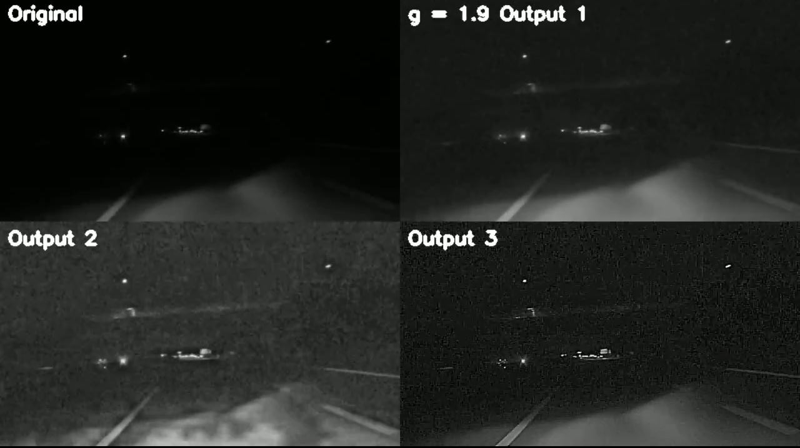
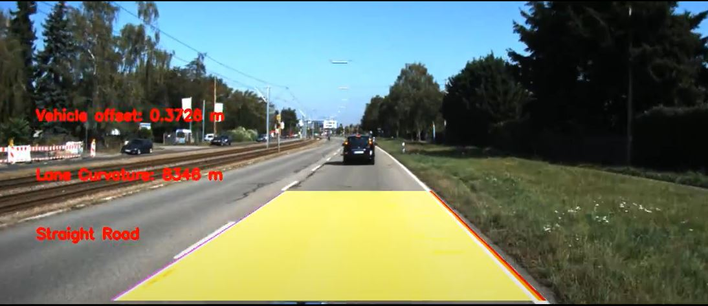
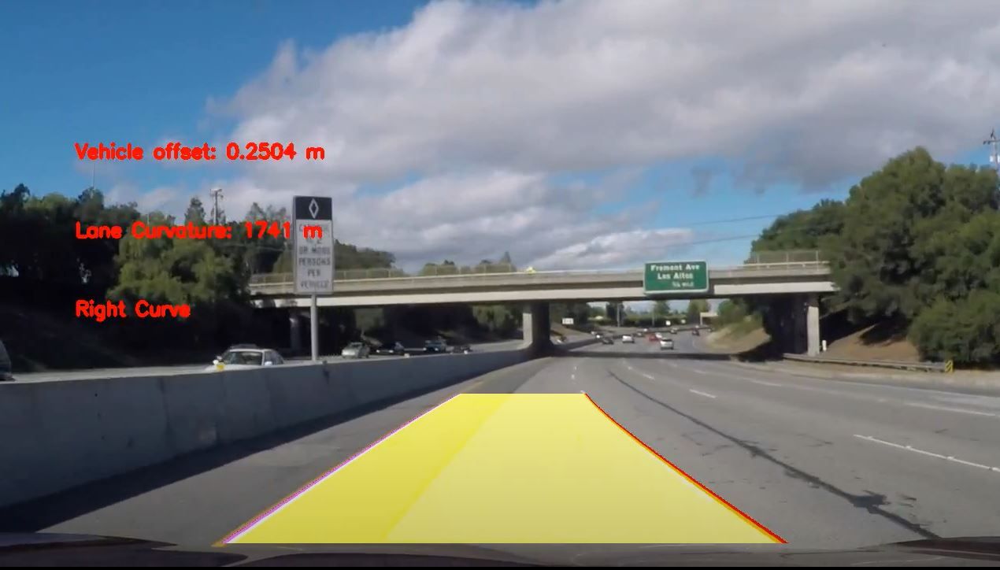

# Lane_Detection    
This project aims to perform Video Enhancement on a night-time 
dashcam video feed and also perform Lane Detection using OpenCv on 
two different types of Datasets.
---
## Instructions
### Dependencies
- Python 3
- Opencv 3.4
- requirements.txt

    Run the following command in the host machine terminal
    ```
    pip install requirements.txt
    ```

## Run Using Command Line
```
git clone https://github.com/kartikv97/Lane_Detection.git
cd Lane_Detection/src
```
Video Enhancement
```
python VideoEnhancement.py
```
Lane Detection on Data 1
```
python LaneDetectionData1.py
```
Lane Detection on Data 2
```
python LaneDetectionData2.py
```

---
## Results
[](https://drive.google.com/file/d/1fvMSO-ta9OvFqL2B3bXHsEtABux850z7/view?usp=sharing)

[](https://drive.google.com/file/d/1LbtXZptIwpyM0cAr-Ifwp4RftyyA30Zq/view?usp=sharing)

[](https://drive.google.com/file/d/1l3ePNdqxZccil4tuxbkyd9TvtPHx8K3k/view?usp=sharing)

### Video Enhancement

### Lane Detection


#### Data 1


#### Data 2

